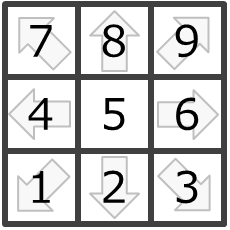

# DSL4GC（Domain Specific Language for Game Control）

**DSL4GC** は [GameControllerizer]() においてディジタルゲームへの入力信号を抽象化し,簡便に表現するための固有言語
（Domain Specific Language for Game Control）であり JSON で記述されます．
可読性にすぐれ，エディットにも特別な環境を必要としません．

これら記述を Node-RED を通してS/WエミュレーターまたはH/Wエミュレータへと送ることで，エミュレータは「あたかも
人間が操作をしているGamepad/Mouse/Keyboard」であるかのように振る舞います．

## 例：GamepadでStreet Fighter 2 の波動拳コマンドを入力
```Javascript
[
  {"dpad":[2], "dur":2}
  {"dpad":[3], "dur":2}  
  {"dpad":[6], "dur":2}
  {"dpad":[5], "btn":[0], "dur":2}
]
```

# 言語仕様
DSL4GC で対象とするデバイスは Gamepad/Mouse/Keyboard とし，
この制御情報を次に示すフォーマットで記載します．

```Javascript
gc_sentence = Array[gc_gamepad_word]  |
              Array[gc_mouse_word]    |
              Array[gc_keyboard_word]
gc_gamaped_word = {c | c ∈ {"dpad","btn","stk0","stk1","cfg_input","dur"}}
gc_mouse_word = {c | c ∈ {"btn","mov","dur"}}
gc_keyboard_word = {c | c ∈ {"key","mod","dur"}}
```

## gc_gamepad_word
下記要素をもつゲームパッドとして抽象化しており個々の要素を制御するためのコマンドをそれぞれ持ちます．さらに入力を変換するためのコンフィグコマンドを持ちます．

- 十字キー：1個
- ボタン：n個
- アナログスティック：2個

### `dpad`
```Javascript
{"dpad": 6}  // 十字キーを右方向へ入力
```
1～9の数値で十字キーの入力を表現します．方向と番号の対応は以下．



### `btn`
```Javascript
{"btn": [0,1,2]}       // 0/1/2番のボタンを押し，そのほかは離す．
{"btn": {"3": true}}   // 3番のボタンを押し，そのほかは現状維持．
{"btn": {"4", false}}  // 4番のボタンを離し，そのほかは現状維持．
```
ボタンの押し込み状態を表現します．押されている全ボタンを `Array` で表現する方法と，ボタン個別の押し込み状態を `Object` で表現する方法があります．個別の操作については `{"btn": {3: true, 4: false}}` のようにマージすることも可能です．

### `stk0`, `stk1`
```Javascript
{"stk0": [127,-63]}    // 左アナログスティックの状態を (x,y)=(127,-63) にする
{"stk1": {"x": 31}}    // 右アナログスティックの状態を (x)=(31) にし，yは現状維持
```
アナログスティックの倒しこみ状態を表現します．スティックのX/Y軸の状態をあわせて `Array` で表現する方法と，軸個別の倒し込み状態を `Object` で表現する方法があります．値域は-127～127です．

### `cfg_input`
```Javascript
{"cfg_input": {"dpad": 1}}    // 十字キーの入力を左右反転する
```
入力方法の変換方式を表現します．多くのゲームでは自キャラクターの位置により操作が左右反転しますが，こういった状況に対応するために使うことを想定しています．

#### ターゲット
- `dpad` : 十字キー
- `stk0` : 左アナログスティック
- `stk1` : 右アナログスティック

#### 変換方式
- 0 : 変換なし
- 1 : 操作を左右反転する
- 2 : 現方式と逆にする（0→1 or 1→0）

### `dur`
各要素に対するコマンド群（`dpad`, `btn`, `stk0`, `stk1`）は3タイプの入力方法を指定でき，これをduration（`dur`）によって表現します．

#### Push（1～127）
同時に指定されたコマンドを**指定期間だけ適用し次の処理に移ります**（次のコマンドを適用する or １つ前の状態にもどる）．単位は frame です（1 frame = 16.666msに相当）．**指定期間が過ぎるまで次のコマンドは適用されません**．

#### Hold（-1）
同時に指定されたコマンドを**次のコマンドがくるまで適用し続けます**（UI上で `Release` と記載されているものがありますが，実態は `Hold` です）．

#### Chain（undefined or 0）
これ以降最初に `Push` / `Hold` コマンドが指定された時点で，それまでに指定された全コマンドが適用されます（ただしConfigコマンドは発行した時点で即適用されます）．

### 記述例
```Javascript
// Push. 十字キーを右方向に3frame入力し，次の処理に移ります（以下2つは等価）．
{"dpad": 6, "dur":3}
[{"dpad": 6}, {"dur":3}]
// Hold. 十字キーを6方向に入力し，次のPush/Holdコマンドが来るまで保持します（以下2つは等価）．
{"dpad": 6, "dur":-1}
[{"dpad": 6}, {"dur": -1}]
// Chain．すぐには適用されず，次のコマンドを待ちます．
{"dpad": 6}
```

## gc_mouse_word
下記要素をもつマウスとして抽象化しました．
- ボタン：3個
- 移動軸：2軸

### `btn`
ボタンの押し込み状態を表現します．0 : 左ボタン，1 : 右ボタン，2 : 中央ボタン．記述方法は Gamepad の `btn` に準じます．

### `mov`
マウスの相対移動量を表現します．画面に対して左上を原点とします．記述方法は Gamepad の `stk0` / `stk1` に準じます

### `dur`
Gamepadの場合に同じです．

### 記述例
```Javascript
// 左クリック
{"btn": [0], "dur": 2}    
// 左クリック，そのほかは現状維持（以下2つは等価）
{"btn": {"0": true}, "dur": 2}
[{"btn": {"0": true}}, {"dur": 2}]
```

## gc_keyboard_word
下記要素をもつキーボードとして抽象化しました.
- Alphanumeric keys（”a”～”z”,”0”～”9”）
- Arrow pad keys（”ArrowUp”, “ArrowDown”, “ArrowRight”, “ArrowLeft”）
- Function keys（”F1”～”F12”, “Escape”）
- Functional keys （”Space”, “Tab”, “Enter”, “Backspace”）
- Modifierkey（”Ctrl”, “Shift”, “Alt”）

現実のkeyboardには上記以外にも多数のキーが存在します．しかしこれらを含めて統一的に扱う標準仕様は存在しておらず，OS，ロケーション，機器，入力を受け取るアプリケーション（例：ウェブブラウザ）によりまちまちです．そのため，現状のGameControllerizer では抽象化の範囲を一般的にゲームコントロールに使われるであろうキーのみに限定しています．

### `key`
Modifierkeyを除くキーの押し込み状態を表現します．記述方法は Gamepad の `btn` に準じます．

### `mod`
Modifierkeyの押し込み状態を表現します．記述方法は Gamepad の `btn` に準じます．

### `dur`
Gamepadの場合に同じです．

### 記述例
```Javascript
// "a"をタイプ
{"key":["a"], "dur":2}
// "A"をタイプ，そのほかは現状維持（以下2つは等価）
{"key": {"a": true}, "mod": ["Shift"], "dur": 2}
{"key": {"a": true}, "mod": {"Shift": true}, "dur": 2}
```

## DSL記載におけるヒント

### ヒント１
別個の要素に対するコマンドはマージして記述することができます．以下の場合
`dpad`, `btn`, `stk0`, `stk1` に対する各操作が 2-frame 間適用されます．
```Javascript
{"dpad":[5], "btn":[1,2], "stk0":[127,-127], "stk1":{"x":63}, "dur":2}
```
`dur` の項にあるように，上記コマンドは次と等価です．
```Javascript
[
  {"dpad":[5]},
  {"btn":[1,2]},
  {"stk0":[127,-127]},
  {"stk1":{"x":63}},
  {"dur":2}
]
```

### ヒント２
操作の適用時間は DSL で指定することもできますが，実時間として扱うこともできます．例えば，ビジュアルプログラミング部に入力/出力される gc_sentence において，以下2つの gc_sentence は等価であり交換可能です．

#### 表現1
```Javascript
 [{"btn": {"3": true}, "dur":2}]
```

#### 表現2
```Javascript
[{"btn": {"3": true},  "dur":-1}]
// 実時間で 0.033msec（2-frame）後に以下を発行
[{"btn": {"3": false}, "dur":-1}]
```
